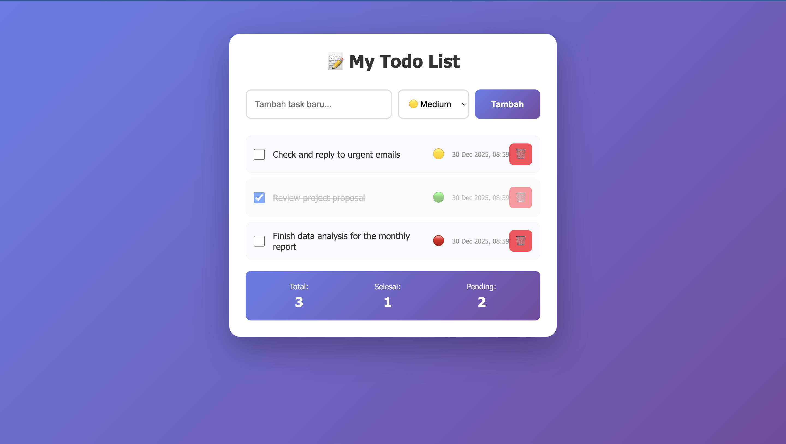

# 📝 Todo List App


Aplikasi Todo List sederhana dan modern berbasis PHP dengan fitur priority management. Dibangun dengan fokus pada UI/UX yang clean dan responsive.

## ✨ Features

- ✅ **CRUD Operations** - Tambah, tandai selesai, dan hapus task dengan mudah
- 🎯 **Priority System** - Kategorikan task berdasarkan prioritas (High, Medium, Low)
- 📊 **Real-time Statistics** - Monitor jumlah task total, selesai, dan pending
- 💾 **Session Storage** - Data tersimpan selama session browser aktif
- 📱 **Responsive Design** - Tampilan optimal di desktop, tablet, dan mobile
- 🎨 **Modern UI** - Gradient design dengan smooth animations
- ⚡ **Fast & Lightweight** - No database required, pure PHP session

## 🚀 Demo



> **Note:** Screenshot akan ditambahkan setelah deployment

## 📋 Table of Contents

- [Installation](#-installation)
- [Usage](#-usage)
- [Tech Stack](#-tech-stack)
- [Project Structure](#-project-structure)
- [Features Detail](#-features-detail)
- [Screenshots](#-screenshots)
- [Roadmap](#-roadmap)
- [Contributing](#-contributing)
- [License](#-license)
- [Author](#-author)

## 💻 Installation

### Prerequisites

Pastikan kamu sudah install:
- **XAMPP** / WAMP / LAMP (PHP 7.4 atau lebih tinggi)
- Web browser modern (Chrome, Firefox, Safari, Edge)

### Step-by-Step

1. **Clone repository**
   ```bash
   git clone https://github.com/Natt-ui/todo-list-app.git
   ```

2. **Pindahkan ke folder htdocs**
   ```bash
   # Untuk XAMPP di Windows
   move todo-list-app C:\xampp\htdocs\

   # Untuk XAMPP di Mac
   mv todo-list-app /Applications/XAMPP/htdocs/

   # Untuk LAMP di Linux
   sudo mv todo-list-app /var/www/html/
   ```

3. **Start Apache Server**
   - Buka XAMPP Control Panel
   - Klik "Start" pada Apache

4. **Buka di Browser**
   ```
   http://localhost/todo-list-app
   ```

## 🎯 Usage

### Menambah Task

1. Ketik task baru di input field
2. Pilih priority level:
   - 🔴 **High** - Task urgent/penting
   - 🟡 **Medium** - Task standar (default)
   - 🟢 **Low** - Task tidak mendesak
3. Klik tombol **"Tambah"**

### Mengelola Task

- **Mark as Complete** - Centang checkbox di sebelah task
- **Delete Task** - Klik icon 🗑️ untuk menghapus
- **View Statistics** - Lihat panel statistik di bawah task list

### Tips & Tricks

💡 **Best Practices:**
- Gunakan priority High hanya untuk task yang benar-benar urgent
- Review dan update task list setiap hari
- Hapus task yang sudah selesai untuk menjaga list tetap clean

## 🛠️ Tech Stack

| Technology | Purpose |
|------------|---------|
| **PHP** | Backend logic & session management |
| **HTML5** | Structure & semantic markup |
| **CSS3** | Styling, animations, & responsive design |
| **JavaScript** | Interactive elements & form handling |
| **Session Storage** | Data persistence during browser session |

### Why These Technologies?

- **No Database Required** - Sempurna untuk quick setup dan learning
- **Pure PHP** - Tidak memerlukan framework, mudah dipahami
- **Lightweight** - Fast loading time dan minimal dependencies
- **Beginner Friendly** - Cocok untuk belajar dasar web development

## 📁 Project Structure

```
todo-list-app/
├── index.php           # Main application file
├── style.css           # Styling & responsive design
├── .gitignore          # Git ignore rules
├── LICENSE             # MIT License
├── README.md           # Documentation (you are here!)
└── screenshots/        # App screenshots
    └── preview.png
```

### File Details

**index.php**
- Handles CRUD operations
- Session management
- HTML rendering

**style.css**
- Modern gradient design
- Responsive breakpoints
- Smooth animations

## 🎨 Features Detail

### Priority System

Tasks dapat dikategorikan dalam 3 level prioritas:

| Priority | Icon | Use Case |
|----------|------|----------|
| High | 🔴 | Deadline hari ini, task kritikal |
| Medium | 🟡 | Task standar, perlu dikerjakan soon |
| Low | 🟢 | Nice to have, tidak urgent |

### Statistics Panel

Real-time metrics yang menampilkan:
- **Total Tasks** - Jumlah semua task
- **Completed** - Task yang sudah selesai
- **Pending** - Task yang masih harus dikerjakan

### Responsive Design

Breakpoints:
- **Desktop** - > 600px (Full layout)
- **Mobile** - < 600px (Stacked layout)

## 📸 Screenshots

### Desktop View


### Mobile View


### Task Management


> **Note:** Screenshots akan segera ditambahkan

## 🗺️ Roadmap

### Version 1.0.0 ✅
- [x] Basic CRUD operations
- [x] Priority system
- [x] Statistics panel
- [x] Responsive design

### Version 1.1.0 (Planned)
- [ ] Task categories (Work, Personal, Shopping, etc.)
- [ ] Due date & time
- [ ] Task notes/description
- [ ] Export to PDF

### Version 2.0.0 (Future)
- [ ] Database integration (MySQL)
- [ ] User authentication
- [ ] Multi-user support
- [ ] Task sharing & collaboration
- [ ] Dark mode
- [ ] Drag & drop reordering

### Ideas & Suggestions

Punya ide untuk fitur baru? Silakan buka [issue](https://github.com/Natt-ui/todo-list-app/issues) atau contribute langsung!

## 🤝 Contributing

Contributions, issues, dan feature requests sangat diterima! 🎉

Lihat [CONTRIBUTING.md](CONTRIBUTING.md) untuk guidelines.

### Quick Start untuk Contributors

1. Fork repository
2. Create feature branch (`git checkout -b fitur-amazing`)
3. Commit changes (`git commit -m 'Add fitur amazing'`)
4. Push to branch (`git push origin fitur-amazing`)
5. Open Pull Request

### Development Setup

```bash
# Clone your fork
git clone https://github.com/YOUR-USERNAME/todo-list-app.git

# Create branch
git checkout -b fitur-baru

# Make changes...

# Test di localhost
# Buka: http://localhost/todo-list-app

# Commit & Push
git add .
git commit -m "Add: deskripsi fitur"
git push origin fitur-baru
```

## 🐛 Bug Reports

Menemukan bug? Silakan buka [issue](https://github.com/Natt-ui/todo-list-app/issues) dengan format:

- **Bug Description** - Apa yang terjadi?
- **Steps to Reproduce** - Cara reproduce bug
- **Expected Behavior** - Hasil yang diharapkan
- **Screenshots** - Jika ada
- **Environment** - Browser, OS, PHP version

## 📝 Changelog

### [1.0.0] - 2024-12-30

#### Added
- Initial release
- Basic todo list functionality
- Priority system (High, Medium, Low)
- Task statistics
- Responsive design
- Session-based storage

## 📄 License

This project is licensed under the **MIT License** - see the [LICENSE](LICENSE) file for details.

### MIT License Summary

✅ Commercial use  
✅ Modification  
✅ Distribution  
✅ Private use  

❌ Liability  
❌ Warranty  

## 👨‍💻 Author

**Natt-ui**

- GitHub: [@Natt-ui](https://github.com/Natt-ui)
- Repository: [todo-list-app](https://github.com/Natt-ui/todo-list-app)

## 🙏 Acknowledgments

- Design inspiration dari modern todo apps
- Gradient color scheme dari [uiGradients](https://uigradients.com)
- Icons: Unicode Emoji
- Testing: Local XAMPP environment

## 💬 Support

Butuh bantuan? Ada pertanyaan?

- 📫 Open an [issue](https://github.com/Natt-ui/todo-list-app/issues)
- 💬 Start a [discussion](https://github.com/Natt-ui/todo-list-app/discussions)

## ⭐ Show Your Support

Kalau project ini membantu kamu, kasih ⭐️ ya!

---

<div align="center">

**[⬆ Back to Top](#-todo-list-app)**

Made with ❤️ by [Natt-ui](https://github.com/Natt-ui)

</div>